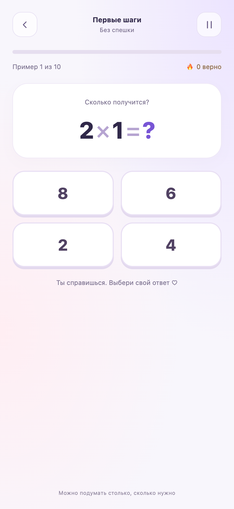

# 🔥 Таблица умножения

**Учиться, видеть свои успехи и зарабатывать время на любимые развлечения.**

**[Скачать игру для Android — APK](https://github.com/ilya668111/multiplication-game-android/releases/latest/download/Mayusha.apk)** · [Версии и инструкция установки](https://github.com/ilya668111/multiplication-game-android/releases/latest)

Android 8.0 и новее · Игра без интернета · Без рекламы и покупок

«Таблица умножения» — игра для Android, которая помогает ребёнку освоить умножение и деление через маленькие, понятные достижения. Здесь у каждого старания есть видимый результат: правильные ответы приближают награду, а каждые десять верных ответов пополняют копилку минут для Roblox или Likee.

Ребёнок видит, сколько уже заработано и сколько верных ответов осталось до следующей награды. Появляется собственная цель: решить ещё несколько примеров, попробовать уровень посложнее, накопить время на любимую игру. Учёба становится способом получить желаемое своими силами — и поводом гордиться собой.

Начать можно с простых примеров без таймера и с выбором ответа из четырёх вариантов. Когда появляется уверенность, можно вводить ответы самостоятельно, решать задания с пропущенным числом или испытать себя в раунде на время. За более сложные примеры копилка пополняется быстрее. Ошибки не отнимают заработанное: к ним можно вернуться, разобраться и попробовать снова.

Накопленные минуты ребёнок показывает маме и выбирает, на какое развлечение их потратить. Мама добавляет время в родительском контроле. Так у семьи появляется понятная договорённость, а у ребёнка — связь между собственными усилиями, успехами в учёбе и заслуженным отдыхом.

Игра создавалась с любовью для дочки, поэтому в ней тёплое оформление, огоньки за успехи и личное обращение. При первом запуске достаточно ввести имя — и на экране появится **«Таблица умножения для Саши»** или **«С любовью для Миши ♡»**. Можно использовать и домашнее ласковое имя.

## Как выглядит игра

  
  
  

Снимки интерфейса игры при размере экрана телефона.

## Что умеет игра

- Умножение, деление без остатка или оба действия вперемешку.
- Обычные примеры и задания с пропущенным числом: `□ × 5 = 30`, `30 ÷ □ = 6`, `□ ÷ 5 = 6`.
- Ответ из четырёх вариантов или самостоятельный ввод на цифровой клавиатуре.
- 10 примеров без таймера либо раунд на 60, 90 или 120 секунд.
- Пауза, звук с выключателем, показ правильного ответа и повторение ошибок.
- Коллекция огоньков и общая копилка минут для Roblox и Likee.
- Имя с автоматическим склонением; ручное исправление доступно в «Изменить имя» → «Поправить склонение имени».
- Игра работает без интернета, рекламы, покупок и регистрации.

## Сложность и награды

| Уровень | Какие числа | Награда за 10 верных |
| --- | --- | --- |
| 🌱 Первые шаги | Один множитель 2, 3, 4, 5 или 10; второй от 1 до 10 | 5 минут |
| 🌷 Уже умею | Оба множителя от 2 до 10 | 7 минут |
| ✨ Суперсила | Оба множителя от 6 до 9 | 10 минут |

Деление строится из тех же пар множителей. Таблиц на 11 и 12 нет: множители не превышают 10, произведение или делимое может достигать 100.

У каждого уровня свой счётчик. Например, девять лёгких примеров и один сложный не превращаются в сложную десятку. Прогресс сохраняется между раундами. Ошибки ничего не отнимают, повторение ошибок тоже приносит минуты. Таймер и ручной ввод доступны на любом уровне; дополнительных множителей награды за них в версии 1.5 нет.

## Копилка и просьба маме

1. Нажать на копилку и выбрать Roblox или Likee.
2. Выбрать количество минут и подтвердить «Списать и написать маме».
3. В меню Android выбрать MAX (или другой мессенджер), затем маму и подтвердить отправку.
4. Мама добавляет это время в родительском контроле на своём телефоне.

У двух приложений **один баланс**: 10 минут можно разделить между ними, но они не удваиваются. Игра сама не меняет ограничения родительского контроля и не отправляет сообщения без подтверждения в мессенджере. Номер телефона получателя в приложении не задан.

Списание сохраняется до открытия меню отправки. Если закрыли мессенджер, запись остаётся в истории; кнопка «Написать маме» повторно открывает ту же просьбу **без нового списания**. В тексте есть дата и время, а также просьба не добавлять одну награду дважды. Подтверждения доставки у игры нет. Пароля на списание нет — копилка рассчитана на договорённость в семье.

## Установка и обновление

Android 8.0 или новее. Интерфейс адаптирован для телефона, в том числе Samsung S24 Ultra.

1. Открыть [последний выпуск](https://github.com/ilya668111/multiplication-game-android/releases/latest) и скачать `Mayusha.apk` из раздела **Assets**.
2. Открыть файл на телефоне и следовать подсказкам установки Android. При необходимости разрешить установку для приложения, которым открыт APK.
3. Запустить **«Таблица умножения»** и ввести имя. Склонение сразу видно в подсказке; необычные формы можно поправить вручную.

Если предыдущая версия уже установлена, **устанавливайте обновление поверх неё без удаления**. Официальные APK этого проекта подписаны одним ключом. При первом запуске версии 1.5 потребуется указать имя; минуты, история и результаты сохраняются. Смена имени тоже сохраняет копилку: это одно приложение с одним профилем, а не отдельные счета для нескольких детей.

Имя, настройки и результаты хранятся только на устройстве. Удаление приложения или очистка его данных удалят сохранения. Облачной синхронизации и резервного копирования нет. В мессенджер передаётся только текст выбранной просьбы, включая имя и сведения о списании.

## Исходники и обратная связь

Полный исходный код открыт под лицензией MIT. [Инструкция сборки и проверки](docs/DEVELOPMENT.md) вынесена на отдельную страницу.

Если нашли ошибку или хотите предложить новую возможность, [создайте обращение](https://github.com/ilya668111/multiplication-game-android/issues). Для ошибки укажите модель телефона, версию Android и шаги, после которых она возникает.

## Лицензия

[MIT](LICENSE). Используется библиотека petrovich-js; сведения и лицензия — в [THIRD_PARTY_NOTICES.md](THIRD_PARTY_NOTICES.md).
